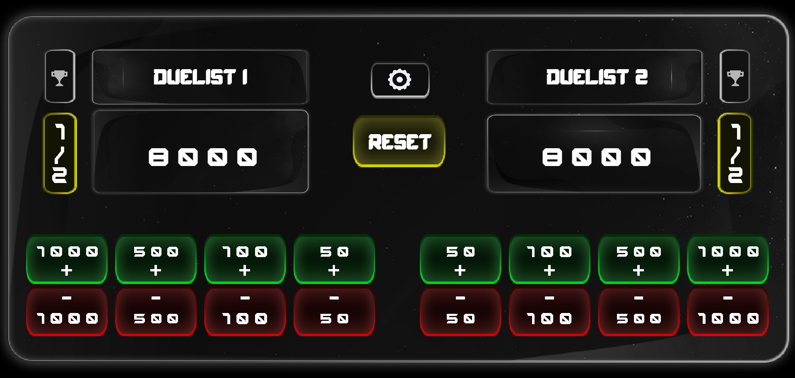
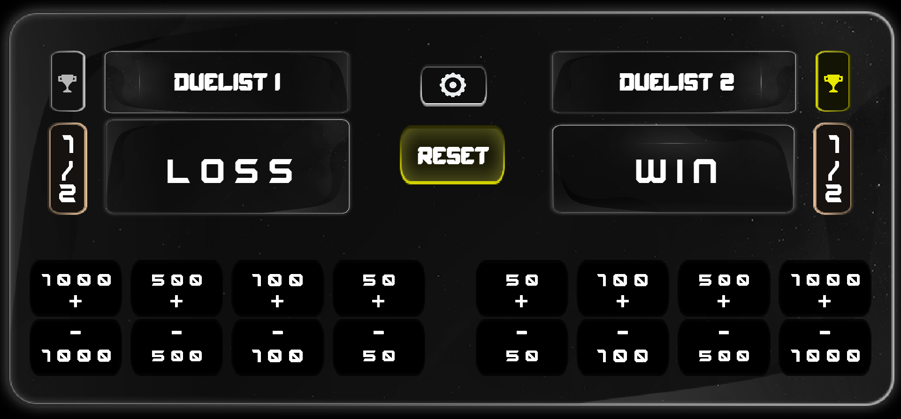
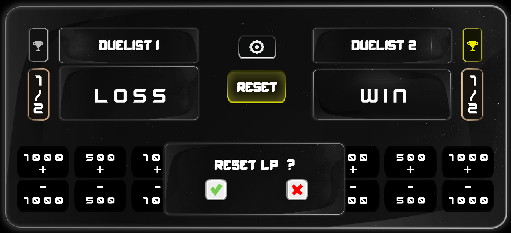
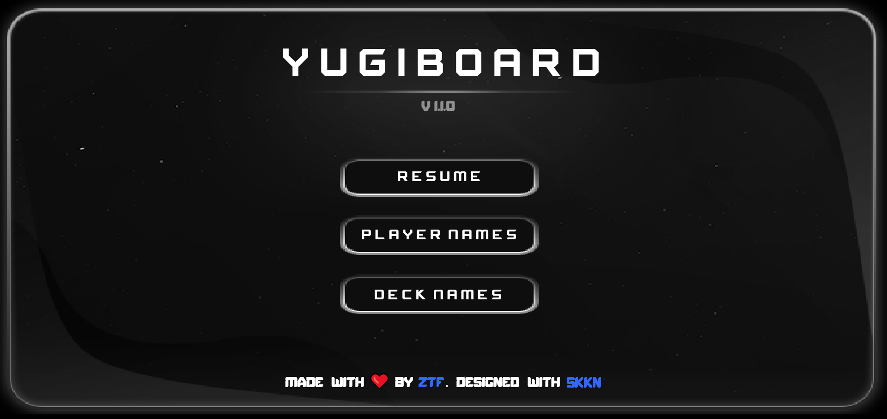
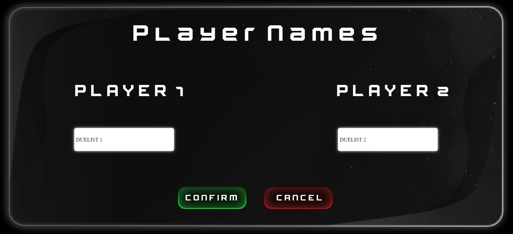
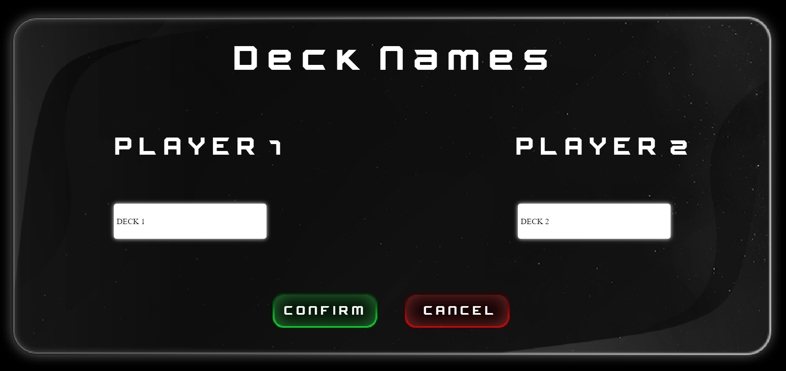

# Yu-Gi-Board

A Yu-Gi-Oh life points board to use with OBS/StreamLabs to manage and display duellists stats on your Twitch overlay during your Yu-Gi-Oh card games !

 
 

Created using  :

# Download : 

<table>
  <tr>
    <td align="center"><a href="https://github.com/ZTF666/YuGiBoard/releases/download/v1.1.0/YuGiBoard-V1.1.0.zip" target='_blank'> <b>Download</b></a></td>
  </tr>
</table>

# Features 

| Features                   | status |
| -------------------------- | ------ |
| Set Duelists Names         | ✅     |
| Set Deck Names             | ✅     |
| Set Rounds                 | ✅     |
| Reset LP                   | ✅     |

# Preview  

# How To Use :  

 Double-click <strong>YuGi Board.exe</strong> to launch the app.

 To set up <strong>Duelists Names</strong> click on the  (button) to go to the setting screen. 

 Once done , click on <strong>Confirm</strong>.

 Once you're back to the <strong>Setting</strong> screen , click on <strong>Resume</strong> to go back to the board.

Same thing goes for deck names. (Naming decks is optional)

<h3>Note : You can always cancel the renaming process by clicking <strong>Cancel</strong> then <strong>Resume.</strong></h3>

# Files location :  

📦YuGiBoard  
 ┣ 📂YuGiData  
 ┃ ┣ 📜Player_1_LP.txt  
 ┃ ┣ 📜Player_2_LP.txt  
 ┃ ┣ 📜Player_1_Name.txt  
 ┃ ┣ 📜Player_2_Name.txt  
 ┃ ┣ 📜Player_1_Rounds.txt  
 ┃ ┣ 📜Player_2_Rounds.txt  
 ┃ ┣ 📜Player_1_Deck.txt  
 ┃ ┣ 📜Player_2_Deck.txt  

## Details :

* <mark>Player_1_LP.txt</mark> : Contains the user's life points.
* <mark>Player_2_LP.txt</mark> : Contains the enemy's life points.
* <mark>Player_1_Name.txt</mark> : Contains the user's display name.
* <mark>Player_2_Name.txt</mark> : Contains the enemy's display name.
* <mark>Player_1_Rounds.txt</mark> : Contains "1" or "0" : The number of rounds won by the duellist 1.
* <mark>Player_2_Rounds.txt</mark> : Contains "1" or "0" : The number of rounds won by the duellist 2.
* <mark>Player_1_Deck.txt</mark> : Contains the user's deck name.
* <mark>Player_2_Deck.txt</mark> : Contains the enemy's deck name.

# Support :

<table>
  <tr>
    <td align="center"><a href="https://www.paypal.com/paypalme/ztf666" target='_blank'> <b>Donations</b></a></td>
  </tr>
</table>

# Contact : 

Feel free to reach out

<strong>ZTF666@protonmail.ch</strong>

# License

**YuGiBoard**
released under the [MIT](LICENSE) License.
  

<strong>
Made with ❤️ by ZTF , Designed with <a href="https://twitch.tv/skkn_tv" target="_blank" style="color:blue"> SkkN </a> | 2022 
 </strong>

