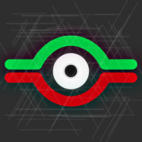

# Yu-Gi-Board

    A Duelists Names & Life Points setting board for OBS Studio to read and display data related to your game on your twitch overlay during a Yu~Gi~Oh tcg match !  
 

Created using  :

# Download : 

<table>
  <tr>
    <td align="center"><a href="https://github.com/ZTF666/YuGiBoard/releases/download/v1.0.0/YuGiBoard-V1.0.0.7z" target='_blank'> <b>Download</b></a></td>
  </tr>
</table>

# How To Use :  

 Double-click <strong>YuGiBoard.exe</strong> to launch the app.

 To set up <strong>Duelists Names</strong> click on the  (button) to go to the setting screen. 

 Once done , click on <strong>Confirm</strong>.

 Once you're back to the <strong>Setting</strong> screen , click on <strong>Resume</strong>to go back to the board.

<h3>Note : You can always cancel the renaming process by clicking <strong>Cancel</strong>then <strong>Resume</strong></h3>

# Files location :  

📦YuGiBoard  
 ┣ 📂YuGiData  
 ┃ ┣ 📜Player_1_LP.txt  
 ┃ ┣ 📜Player_2_LP.txt  
 ┃ ┣ 📜Player_1_Name.txt  
 ┃ ┣ 📜Player_1_Name.txt  

## Details :

* <mark>Player_1_LP.txt</mark> : Contains the user's life points.
* <mark>Player_2_LP.txt</mark> : Contains the enemy's life points.
* <mark>Player_1_Name.txt</mark> : Contains the user's display name.
* <mark>Player_1_Name.txt</mark> : Contains the enemy's display name.

# Support :

<table>
  <tr>
    <td align="center"><a href="https://www.paypal.com/paypalme/ztf666" target='_blank'> <b>Donations</b></a></td>
  </tr>
</table>

# Contact : 

Feel free to reach out

<strong>ZTF666@protonmail.ch</strong>

# License

**Yu-Gi-Board**
released under the [MIT](LICENSE) License.
  

<strong>
Made with ❤️ by ZTF , Designed with <a href="https://twitch.tv/skkn_tv" target="_blank" style="color:blue"> SKKN </a> | 2022 
 </strong>

